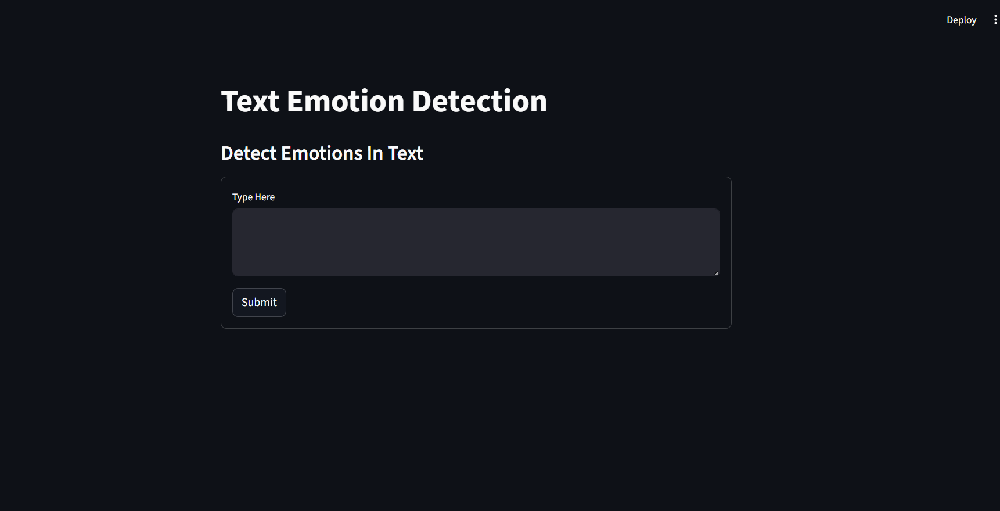
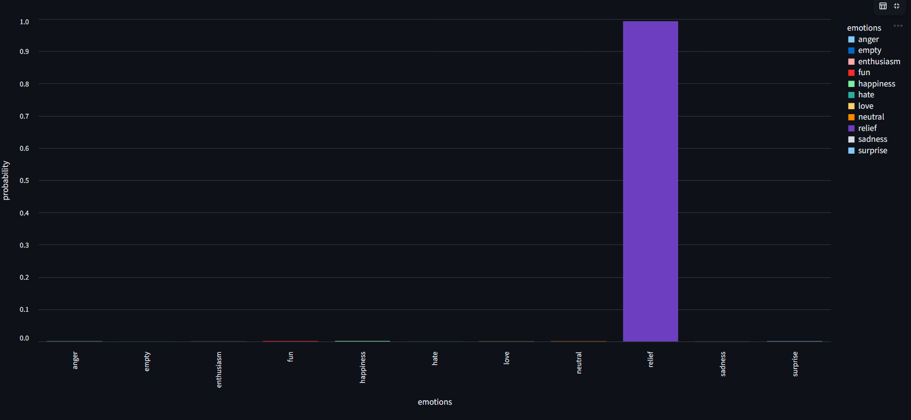

# 😊 Emotion Detection from Text

## 📌 Overview

Emotion Detection from Text is a Machine Learning and Natural Language Processing (NLP) project that predicts human emotions from text. The model is trained on an emotion dataset using multiple machine learning algorithms, and the final model is deployed as an interactive web application using Streamlit.

## 🚀 Features

- Detects emotions from text input
- NLP-based text preprocessing
- Interactive Streamlit web application
- Displays prediction confidence score
- Visualizes prediction probabilities
- Supports multiple emotion classes

## 🛠️ Technologies Used

### Programming Language
- Python

### Development Tools
- Jupyter Notebook
- PyCharm
- Git
- GitHub

### Libraries
- Pandas
- NumPy
- NLTK
- Scikit-learn
- Seaborn
- Matplotlib
- Streamlit
- Altair
- Joblib

### NLP Techniques
- CountVectorizer
- Feature Extraction
- Text Preprocessing

### Machine Learning
- Machine Learning Pipeline
- Train-Test Split
- Logistic Regression
- LinearSVC
- Support Vector Classifier (SVC)
- Random Forest Classifier

## 📂 Project Structure

Emotion-Detection-from-Text/

## 📂 Project Structure

Emotion-Detection-from-Text/

├── app.py
├── text_emotion.pkl
├── final_project.ipynb
├── Home_page.png
├── Prediction_result.png
├── Probability_chart.png
└── README.md

## 📸 Screenshots

### 🏠 Home Page

### 😊 Prediction Result

### 📊 Prediction Probability

## 🎯 Future Improvements

- Deep Learning-based Emotion Detection
- Multilingual Emotion Detection
- Voice Emotion Recognition
- Cloud Deployment

## 👩‍💻 Author

*Vindhya Raj*
